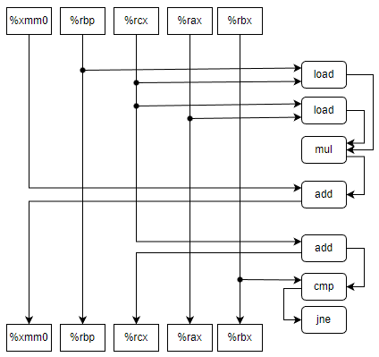
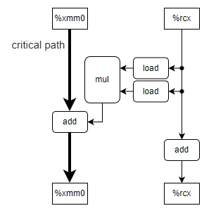
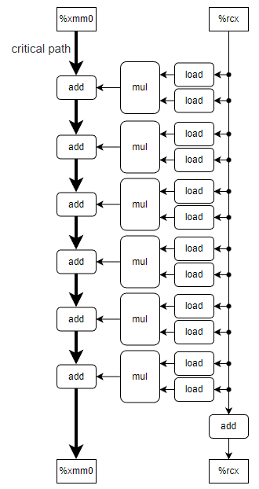

* 5.13<br>
A: <br><br><br>
B: 关键路径上只有一个add计算，浮点数add计算延迟为3，CPE=3<br>
C: 整数add计算延迟为1，CPE=1<br>
D: 关键路径上浮点add计算之间存在数据依赖，CPE为3；而右侧计算路径浮点mul之间没有数据依赖，CPE按照容量计算下限为0.5，整数add计算有数据依赖，CPE为1。因此总体CPE由关键路径决定，CPE=3。
* 5.14<br>
```c++
/* Inner product. Accumulate in temporary */
void inner4(vec_ptr u, vec_ptr v, data_t *dest) {
  long i;
  long length = vec_length(u);
  long limit = length - 5;
  data_t *udata = get_vec_start(u);
  data_t *vdata = get_vec_start(v);
  data_t sum = (data_t)0;

  for (i = 0; i < limit; i += 6) {
    sum += udata[i] * vdata[i];
    sum += udata[i + 1] * vdata[i + 1];
    sum += udata[i + 2] * vdata[i + 2];
    sum += udata[i + 3] * vdata[i + 3];
    sum += udata[i + 4] * vdata[i + 4];
    sum += udata[i + 5] * vdata[i + 5];
  }

  for (; i < length; i++) {
    sum += udata[i] * vdata[i];
  }

  *dest = sum;
}
```
<br>
A:关键路径上每个元素对应一个add操作，其CPE下限为1<br>
B:浮点计算已经达到其CPE下限3<br>
* 5.15<br>
```c++
void inner4(vec_ptr u, vec_ptr v, data_t *dest) {
  long i;
  long length = vec_length(u);
  long limit = length - 5;
  data_t *udata = get_vec_start(u);
  data_t *vdata = get_vec_start(v);
  data_t acc0 = (data_t)0;
  data_t acc1 = (data_t)0;
  data_t acc2 = (data_t)0;
  data_t acc3 = (data_t)0;
  data_t acc4 = (data_t)0;
  data_t acc5 = (data_t)0;

  for (i = 0; i < limit; i += 6) {
    acc0 += udata[i] * vdata[i];
    acc1 += udata[i + 1] * vdata[i + 1];
    acc2 += udata[i + 2] * vdata[i + 2];
    acc3 += udata[i + 3] * vdata[i + 3];
    acc4 += udata[i + 4] * vdata[i + 4];
    acc5 += udata[i + 5] * vdata[i + 5];
  }

  for (; i < length; i++) {
    acc0 += udata[i] * vdata[i];
  }

  *dest = acc0 + acc1 + acc2 + acc3 + acc4 + acc5;
}
```
加载器吞吐量限制和mul容量<6使得CPE无法达到1<br>
* 5.16<br>
```c++
void inner4(vec_ptr u, vec_ptr v, data_t *dest) {
  long i;
  long length = vec_length(u);
  long limit = length - 5;
  data_t *udata = get_vec_start(u);
  data_t *vdata = get_vec_start(v);
  data_t sum = (data_t)0;

  for (i = 0; i < limit; i += 6) {
    sum += (udata[i] * vdata[i] + udata[i + 1] * vdata[i + 1] +
            udata[i + 2] * vdata[i + 2] + +udata[i + 3] * vdata[i + 3] +
            udata[i + 4] * vdata[i + 4] + +udata[i + 5] * vdata[i + 5]);
  }

  for (; i < length; i++) {
    sum += udata[i] * vdata[i];
  }

  *dest = sum;
}
```
* 5.17<br>
```c++
void *memset(void *s, int c, size_t n) {
  size_t cnt = 0;
  size_t K = sizeof(unsigned long);
  unsigned char *schar = s;
  unsigned long *slong = (unsigned long *)s;
  unsigned long lc;
  unsigned char *p_lc = (unsigned char *)&lc;
  // Fill lc with c
  for (size_t i = 0; i < K; ++i) {
    p_lc[i] = (unsigned char)c;
  }
  // Align to K
  while (cnt < n) {
    if ((size_t)schar % K == 0) {
      break;
    }
    *schar++ = (unsigned char)c;
    cnt++;
  }
  // Set by word
  size_t rest = n - cnt;
  // limit is rounded down to a multiple of K
  size_t limit = rest / K * K;
  while (cnt < limit) {
    *slong++ = lc;
    cnt += K;
  }
  // Tail work
  schar = (unsigned char *)slong;
  while (cnt < n) {
    *schar++ = (unsigned char)c;
    cnt++;
  }
  return s;
}
```
* 5.18<br>
将原式拆成4组分别计算，提取公共因子。使用了4×4的优化方法
$$
r1=((a0+a4x^4)+a8x^8+...)\\
r2=((a1+a5x^4)+a9x^8+...)x\\
r3=((a2+a6x^4)+a10x^8+...)x^2\\
r4=((a3+a7x^4)+a11x^8+...)x^3\\
ret = r1+r2+r3+r4
$$
```c++
double poly(double a[], double x, long degree) {
  size_t i;
  size_t limit = degree - 3;
  double ret = 0;
  double r1 = 0, r2 = 0, r3 = 0, r4 = 0;
  double xn = 1, x4 = pow(x, 4);

  for (i = 0; i < limit; i += 4) {
    r1 += a[i] * xn;
    r2 += a[i + 1] * xn;
    r3 += a[i + 2] * xn;
    r4 += a[i + 3] * xn;
    xn *= x4;
  }

  for (; i < degree; i++) {
    r1 += a[i] * xn;
    xn *= x;
  }

  ret = (r1 + r2 * x + r3 * pow(x, 2) + r4 * pow(x, 3));
  return ret;
}
```
* 5.19<br>
```c++
void psum(float a[], float p[], long n) {
  size_t i;
  size_t limit = n - 3;
  float t = 0, t0 = 0, t1 = 0, t2 = 0, t3 = 0;
  for (i = 0; i < limit; i += 4) {
    t0 = t + a[i];
    t01 = a[i] + a[i + 1];
    t1 = t + t01;
    t2 = t0 + (a[i + 1] + a[i + 2]);
    t23=a[i + 2] + a[i + 3];
    t3 = t1 + t23;
    t = t + t01+t23;
    p[i] = t0;
    p[i + 1] = t1;
    p[i + 2] = t2;
    p[i + 3] = t3;
  }

  for (; i < n; i++) {
    t += a[i];
    p[i] = t;
  }
}
```
4个元素共使用9次浮点加法，按照吞吐量计算至少需要9个时钟周期，CPE为9/4=2.25。暂未想到CPE达到1.67的方法
